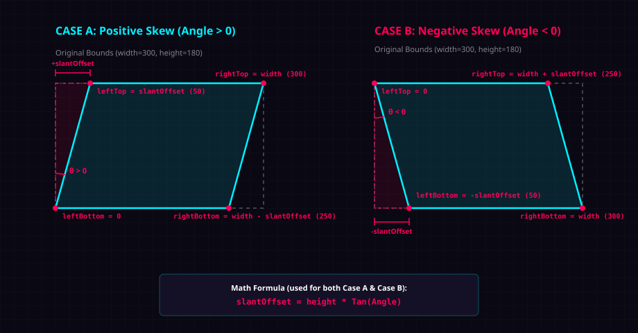

# Skew Geometry & Trigonometry Explanation

Here is a visual explanation of how the custom `Skew` and `SkewButton` components calculate their shapes and boundaries for both **Case A (Positive Skew)** and **Case B (Negative Skew)**.



---

## Math Behind the Slant

Regardless of the direction, the slant is determined using the tangent of the angle:

$$\text{slantOffset} = \text{height} \times \tan(\theta)$$

In C# code:
```csharp
slantOffset = rect.height * Mathf.Tan(clampedAngle * Mathf.Deg2Rad);
```

---

## The Two Cases in `ContainsPoint`

When you click or hover, Unity checks if the cursor's coordinate `localPoint` is inside the diagonal boundary. The code handles this dynamically by setting the top-left (`leftTop`) and bottom-left (`leftBottom`) starting offsets depending on whether the angle is positive or negative:

### Case A: Positive Skew (Angle > 0)
When the angle is positive, the shape slants **to the right**. The left edge shifts right at the top, and returns to $x = 0$ at the bottom.
* **Anchor Offsets:**
  * `leftTop` = `slantOffset`
  * `leftBottom` = `0`
  * `rightTop` = `width`
  * `rightBottom` = `width - slantOffset`
* **Boundary:** Slopes back to the left from top to bottom.

### Case B: Negative Skew (Angle < 0)
When the angle is negative, the shape slants **to the left**. The left edge starts at $x = 0$ at the top, and shifts right at the bottom.
* **Anchor Offsets:**
  * `leftTop` = `0`
  * `leftBottom` = `-slantOffset` *(which is a positive value, since slantOffset is negative)*
  * `rightTop` = `width + slantOffset` *(slantOffset is negative, shifting it left)*
  * `rightBottom` = `width`
* **Boundary:** Slopes forward to the right from top to bottom.

---

## The Hit Detection Check
Once the anchors are set, the code linearly interpolates the left boundary `minX` for the current cursor Y-position `t` (from 0 to 1), and adds the constant width to find the right boundary `maxX`:

```csharp
// 1. Percentage height of cursor
float t = localPoint.y / rectHeight;

// 2. Find left edge at this height
float minX = Mathf.Lerp(leftTop, leftBottom, t);

// 3. Find right edge at this height
float maxX = minX + (rectWidth - Mathf.Abs(slantOffset));

// 4. Check boundaries
return localPoint.x >= minX && localPoint.x <= maxX;
```
